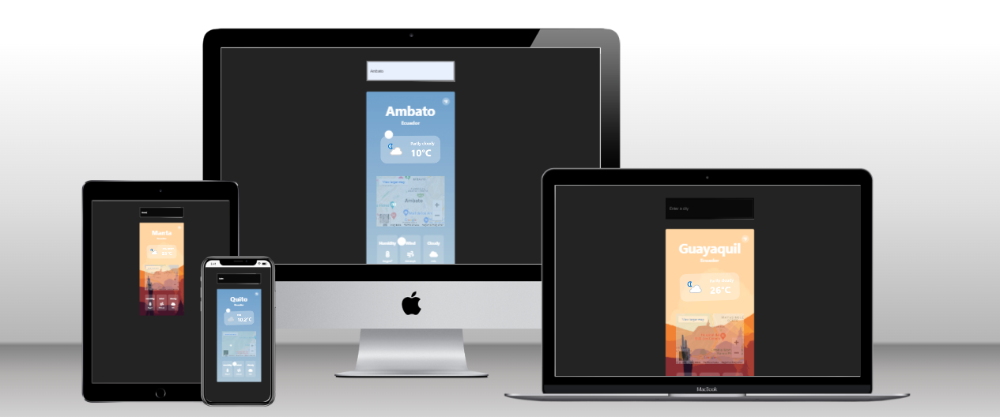
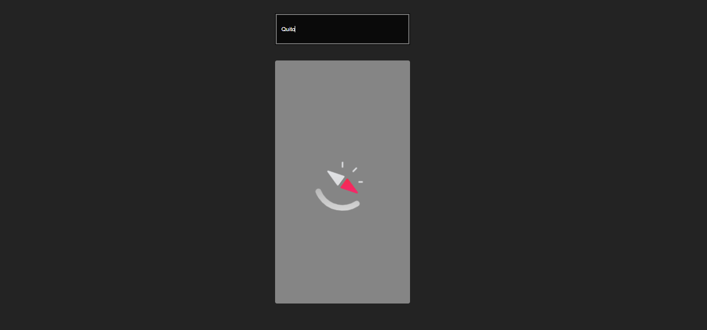
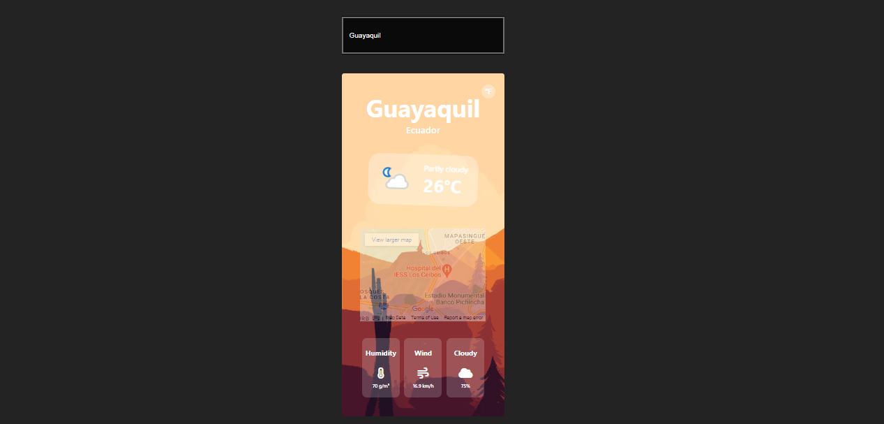

<div align="center">
  
  
</div>

<h1 align="center">
    Weather App
</h1>

<p align="center">
  <a href="#about-the-project">About The Project</a> |
  <a href="#layout">Layout</a> |
  <a href="#technologies">Technologies</a> |
  <a href="#contribution">Contribution</a> |
  <a href="#author">Author</a> |
  <a href="#license">License</a>
</p>

<div align="center">
  
</div>

</br>

---

<h4 align="center">
	🚧 Status: Building 🚀  🚧

  <p align="center">https://to-do-list-swart-delta.vercel.app/</p>

</h4>

---

</br>

<h2 id="about-the-project" > ⏰📈 About The Project </h2>

1. Check the weather in your city.
2. Check the weather in any city around the world.

## Next steps:

- [ ] Weather per day;

---

## 🚀 Getting Started

First, run the development server:

```bash
# Clone Repository
$ git clone https://github.com/joseandresgavilanes/weather__app
# Go to server folder
$ cd weather__app
# Install Dependencies
$ npm i
# Run Aplication with ViteJS
$ npm run dev
```

---

<h2 id="layout" >🎨  Layout </h2>

### LOADER



---

### FIND A CITY (WARM)



---

### FIND A CITY (COLD)


---

<h2 id="technologies"> 🛠 Technologies </h2>

The following tools were used in the construction of the project:

- **[ReactJS](https://reactjs.org)**
- **[Javascript](https://www.javascript.com/)**
- **[ViteJS](https://vitejs.dev/)**
- **[WeatherAPI](https://www.weatherapi.com/)**

---

<h2 id="contribution"> 💪 Contribution </h2>

Contributions are what make the open source community such an amazing place to be learn, inspire, and create. Any contributions you make are **greatly appreciated**.

1. Fork the Project
2. Create your Feature Branch (`git checkout -b feature/AmazingFeature`)
3. Commit your Changes (`git commit -m 'Add some AmazingFeature'`)
4. Push to the Branch (`git push origin feature/AmazingFeature`)
5. Open a Pull Request

---

<h2 id="author"> 💻 Author </h2>


<sub><b>José Andrés Gavilanes - Smiley</b></sub></a> <a href="https://www.linkedin.com/in/jose-andres-gavilanes-2954691b5/" title="jose`s linkedin">🚀</a>
<br />
[](https://www.linkedin.com/in/jose-andres-gavilanes-2954691b5/)
[](mailto:joseandresgavilanes2012@gmail.com)

---

<h2 id="license"> 🧍‍♀️🧍‍♂️ Acknowledgements </h2>
https://www.youtube.com/watch?v=oT-feDPuJmk&t=2829s 
(VIDA MRR)

---

<h2 id="license"> 📝 License </h2>
This project is under the [MIT](./LICENSE) license.
